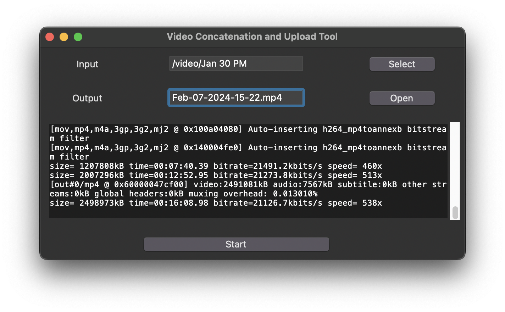

# Video Concatenation and Upload Tool

This tool is designed to automate the process of concatenating multiple MP4 files within a selected folder and uploading the resulting file to YouTube. It provides a simple graphical user interface (GUI) to select the source folder, set the desired output filename, and track the progress of the concatenation process.



## Features
- Folder selection for source MP4 files.
- Automated naming for the output file based on the current date and time.
- Concatenation of all MP4 files in the selected folder using FFmpeg.
- Progress bar indicating the concatenation progress.
- (Future feature) Direct upload functionality to YouTube.

## Prerequisites

Before you begin, ensure you have met the following requirements:
- Python 3.6 or higher
- FFmpeg installed and added to the system's PATH
- Google API Python Client library for YouTube Data API v3 (for future YouTube upload functionality)

## Setup
1. Clone the repository or download the source code to your local machine.
2. Install the required Python libraries by running:

```bash
pip install tk
```


## Usage

To use the Video Concatenation and Upload Tool:
1. Run the script using Python:

```bash
python video_concat_tool.py
```


1. Use the "Select" button to choose the folder containing your MP4 files.
2. The "Output" field will automatically populate with the default filename based on the current time. You can edit this if desired.
3. (Optional) Use the "Open" button to choose a different output directory.
4. Click "Start" to begin concatenating the videos. The progress bar will indicate the operation's progress.
5. Once concatenation is complete, the output file will be available at the specified location.

## Contributing

Contributions to this project are welcome. Please adhere to this project's `code of conduct` during your participation.

## License

This project is licensed under the MIT License - see the `LICENSE` file for details.

## Acknowledgements 
- This tool uses FFmpeg for video processing: [FFmpeg](https://ffmpeg.org/) 
- Google APIs for YouTube integration: [Google Developers]()

## Contact

If you have any questions or feedback, please reach out to the repository owner.---

You can save this text as `README.md` in the root directory of your project. This will display the information on the main page of the repository if you use a service like GitHub or GitLab. Remember to replace the placeholder (`video_concat_tool.py`, `code of conduct`, `LICENSE`, and contact details) with the actual information relevant to your project.